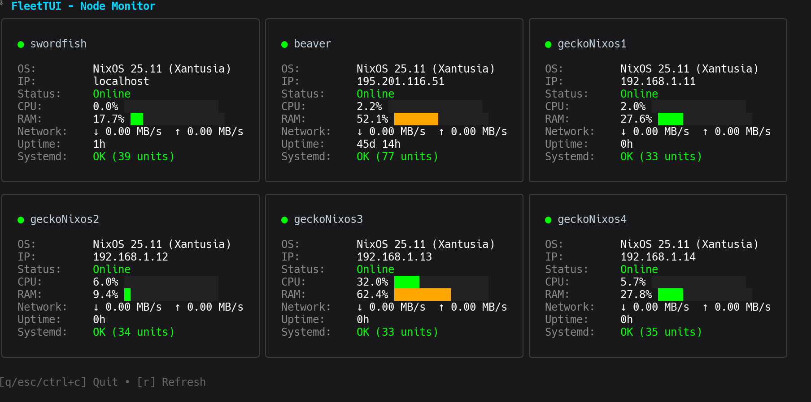

# FleetTUI

A TUI for monitoring your server fleet in real-time. Built with Go and the [Charm](https://charm.sh) stack.



## Features

- **Real-time Monitoring**: Track CPU, RAM, network usage, uptime, and systemd status
- **Cards**: Each node displayed in a detailed card with progress bars and status indicators
- **Parallel Collection**: Fetches metrics from all hosts concurrently using goroutines
- **Configurable**: Enable/disable specific metrics via YAML configuration

## Installation

### From Source

```bash
git clone https://github.com/JustAlternate/fleettui.git
cd fleettui
go install .
```

## Quick Start

1. **Create the configuration directory:**
   ```bash
   mkdir -p ~/.config/fleettui
   ```

2. **Create `~/.config/fleettui/hosts.yaml`:**
   ```yaml
   hosts:
     - name: web-server-01
       ip: 192.168.1.10
       user: root
     - name: database-01
       ip: 192.168.1.20
       user: admin
   ```

3. **Create `~/.config/fleettui/config.yaml` (optional):**
   ```yaml
   refresh_rate: 5s
   metrics:
     - cpu
     - ram
     - network
     - connectivity
     - uptime
     - systemd
     - os
   ```

4. **Run FleetTUI:**
   ```bash
   fleettui
   ```

## Configuration

### Hosts Configuration (`hosts.yaml`)

```yaml
hosts:
  - name: server-01              # Display name
    ip: 192.168.1.10             # IP address or hostname
    user: root                   # SSH user (default: root)
    ssh_key_path: ~/.ssh/id_rsa  # Optional: specific SSH key
```

**Notes:**
- If `user` is not specified, defaults to `root`
- If `ssh_key_path` is not specified, uses the first key found in `~/.ssh/`

### Application Configuration (`config.yaml`)

```yaml
refresh_rate: 5s              # How often to refresh metrics
metrics:                      # Enabled metrics
  - cpu                       # CPU usage percentage
  - ram                       # RAM usage percentage
  - network                   # Network I/O rates (MB/s)
  - connectivity              # SSH connectivity status
  - uptime                    # System uptime
  - systemd                   # Failed systemd units
  - os                        # OS name from /etc/os-release
```

## Usage

```
[q/esc/ctrl+c]  Quit
[r]             Force refresh
```

## Requirements

- Remote hosts must have standard Linux utilities (`top`, `free`, `cat`, `systemctl`)

## Development

```bash
# Clone and build
git clone https://github.com/JustAlternate/fleettui.git
cd fleettui
go build .

# Run tests
go test ./...
```

## License

MIT License.
